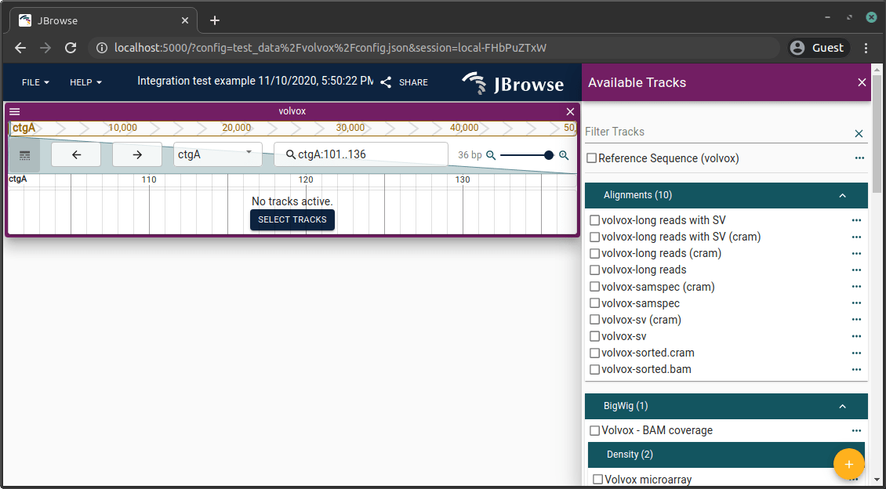
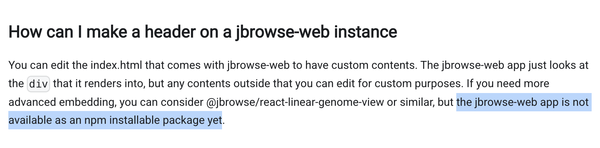

# jbrowse-web

[](https://github.com/Abrar-Abir/jbrowse-web/actions/workflows/ci.yml)
[](LICENSE)
[](https://github.com/GMOD/jbrowse-components/releases/tag/v4.1.14)
[](https://www.npmjs.com/package/@gnomix/jbrowse-web)
[](https://github.com/Abrar-Abir/jbrowse-web)

The official [JBrowse 2 Web](https://jbrowse.org) application is distributed only as a pre-built zip or as a React component for embedding — there is no supported way to fork and customize the standalone product. **This repo is that fork.**



<sub>Screenshot from the [JBrowse 2 web quickstart](https://jbrowse.org/jb2/docs/quickstart_web/).</sub>

## Why this exists

If you want to **customize the JBrowse Web application itself** — change its startup flow, add custom routes, modify the session loader, swap the admin server, embed it inside a larger product — your only option today is to clone the [jbrowse-components](https://github.com/GMOD/jbrowse-components) monorepo and work from there. That monorepo is a pnpm workspace of ~30 cross-referenced packages, with `workspace:^` dependency references, custom Node loaders, a shared webpack config that calls `pnpm recursive list` to discover packages, and devDependencies declared at the root rather than in `products/jbrowse-web`. You can't simply lift `products/jbrowse-web` out and run it — none of its dependencies resolve, none of the build scripts work, and the shared webpack config doesn't exist at the path it expects.

The official alternatives don't fill this gap either:

- **`jbrowse create`** ([docs](https://jbrowse.org/jb2/docs/quickstart_web/)) downloads a pre-built static zip. You get a working JBrowse Web instance, but you cannot modify the source — it's a binary distribution.
- **`@jbrowse/react-app2`** ([docs](https://jbrowse.org/jb2/docs/embedded_components/)) is a React component meant to be dropped *into your own React app*. It is not the standalone jbrowse-web product: you don't get the session loader, IndexedDB session persistence, URL/share-link routing, the admin server `/updateConfig` flow, or the rest of jbrowse-web's app shell.
- **`@jbrowse/react-linear-genome-view2` / `@jbrowse/react-circular-genome-view2`** are even more lightweight — single views you embed, not an application.
- The JBrowse FAQ historically confirmed this directly: *"the jbrowse-web app is not available as an npm installable package yet."*

  

This repo fills that gap. It extracts `products/jbrowse-web` at a pinned upstream version (**v4.1.14**) and patches it into a self-contained npm project:

- `workspace:^` references replaced with published `^4.1.14` versions of `@jbrowse/*` packages from npm
- Shared webpack config copied in locally and the `pnpm recursive list` call replaced with a static path
- Build script imports rewritten from `../../../webpack/...` to local paths
- All devDependencies (previously declared at the monorepo root) declared explicitly
- Custom Node loader scripts replaced with [tsx](https://tsx.is/) so `npm start` and `npm run build` Just Work

Clone it, `npm install`, `npm run build` — no pnpm, no monorepo. You own the source of `src/` and can modify any of it. See [Customization](#customization) for the natural extension points.

## Prerequisites

- Node.js 18+
- npm

## Install from npm

```bash
npm install @gnomix/jbrowse-web
```

## Quick start (from source)

```bash
git clone https://github.com/Abrar-Abir/jbrowse-web.git
cd jbrowse-web
npm install
npm start        # dev server → http://localhost:3000
```

## Commands

| Command | Description |
|---|---|
| `npm start` | Dev server with HMR on port 3000 (override with `PORT=`) |
| `npm run build` | Production build → `build/` |
| `npm run serve` | Serve production build on port 4000 |

## Configuration

A minimal default `public/config.json` ships with the repo — a single hg38 assembly using publicly hosted reference data — so `npm start` renders out of the box. Replace it with your own to load custom assemblies and tracks; see the [JBrowse config docs](https://jbrowse.org/jb2/docs/config_guides/assemblies/) for the full schema.

## Consuming as an npm package

The published `@gnomix/jbrowse-web` package exposes two named exports — `./rootModel` and `./makeWorkerInstance` — for downstream projects that want to embed or extend the app shell. Both point to **TypeScript source**, so consuming projects must use a TypeScript-aware bundler (webpack, Vite, esbuild, etc.) or loader (`tsx`, `ts-node`); raw Node cannot strip types from `node_modules`.

```ts
import rootModel from '@gnomix/jbrowse-web/rootModel'
import makeWorkerInstance from '@gnomix/jbrowse-web/makeWorkerInstance'
```

## Customization

Four natural extension points cover most needs:

- **[src/corePlugins.ts](src/corePlugins.ts)** — the 29-plugin array passed into `PluginManager`. Drop a plugin (e.g. remove `@jbrowse/plugin-circular-view` to disable circular views) or append your own `Plugin` subclass.
- **[src/components/JBrowse.tsx](src/components/JBrowse.tsx)** — the app shell: `ThemeProvider`, `HeaderButtons`, and the admin-server snapshot listener. Swap `ShareButton` for a custom header element, or change the `/updateConfig` admin endpoint.
- **[public/config.json](public/config.json)** — the assemblies and tracks loaded on boot. Replace the bundled hg38-only config with your own assembly/track set; see the [JBrowse config docs](https://jbrowse.org/jb2/docs/config_guides/assemblies/).
- **[src/makeWorkerInstance.ts](src/makeWorkerInstance.ts)** — the worker entry (webpack-5 native worker module). Override to point at a pre-bundled worker or a test mock.

Local diffs from upstream are tracked in [UPSTREAM.md](UPSTREAM.md).

## Upgrading

```bash
bash scripts/upgrade.sh v4.2.0
```

**Prerequisites:** a clean working tree. The script is destructive — it `rm -rf`s `src/`, `scripts/`, `public/`, `webpack/`, and `tsconfig.json` before re-copying from the upstream tag, so any uncommitted changes in those paths will be lost.

**What it does:** clones `GMOD/jbrowse-components` at `<version-tag>` into `/tmp/jbrowse-src`, replaces the directories above with their upstream copies, then re-applies the standalone patches: `workspace:^` → `^<version>` in `package.json`, monorepo-relative webpack imports rewritten in `scripts/build.ts` and `scripts/start.ts`, and `getWorkspaces()` in `webpack/config/webpack.config.ts` rewritten to a static `node_modules/@jbrowse` path.

**Verified 2026-05-02 against `v4.1.14`** as a no-op upgrade. The script exits 0, but verification surfaced two known footguns worth restoring afterward:

- `scripts/upgrade.sh` itself is removed (the `rm -rf scripts/` happens before the script's self-backup step, so the backup fails silently and the upstream `scripts/` copy doesn't include it).
- `public/config.json` is wiped (this repo's bundled hg38 config is not part of upstream's `products/jbrowse-web/public/`).

Both are tracked files, so on a clean tree they can be restored in one step:

```bash
git checkout HEAD -- scripts/upgrade.sh public/config.json
```

**After running:**

1. `git checkout HEAD -- scripts/upgrade.sh public/config.json` to restore the two files above.
2. Re-apply any custom modifications (see [UPSTREAM.md](UPSTREAM.md) for the current diff list).
3. `npm install`
4. `npm run build`
5. Smoke-test with `npm start` and load `http://localhost:3000`.

Note: the script is **not idempotent** — running it twice in a row will fail at the patch step, since the second run sees already-patched inputs. If you need to re-run, start from a clean tree.

For a manual walkthrough, see [Upgrading to a newer JBrowse version](#upgrading-to-a-newer-jbrowse-version) below.

---

## How this was extracted from the monorepo

Follow these steps to recreate or upgrade the standalone setup from scratch.

### 1. Clone the monorepo at the target version

```bash
git clone --depth 1 --branch v4.1.14 https://github.com/GMOD/jbrowse-components.git /tmp/jbrowse-src
```

### 2. Copy source files

```bash
cp -r /tmp/jbrowse-src/products/jbrowse-web/src .
cp -r /tmp/jbrowse-src/products/jbrowse-web/scripts .
cp -r /tmp/jbrowse-src/products/jbrowse-web/public .
cp /tmp/jbrowse-src/products/jbrowse-web/package.json .
cp /tmp/jbrowse-src/products/jbrowse-web/tsconfig.json .

# Shared webpack config (used by build scripts)
cp -r /tmp/jbrowse-src/webpack .
```

### 3. Remove monorepo-only files

```bash
rm -f public/test_data      # broken symlink to monorepo test data
rm -f public/umd_plugin.js  # test-only file
rm -rf src/tests src/__snapshots__ src/*.test.ts src/rootModel/__snapshots__ src/rootModel/*.test.ts
```

### 4. Add your config

```bash
cp build/config.json public/config.json
```

### 5. Patch package.json

**Replace workspace dependencies:**

```bash
sed -i 's/"workspace:\^"/"^4.1.14"/g' package.json
```

**Add missing peer dependencies** (MUI requires Emotion packages declared at monorepo root):

```json
"@emotion/cache": "^11.14.0",
"@emotion/react": "^11.14.0",
"@emotion/styled": "^11.14.1"
```

**Add devDependencies** (provided by monorepo root, must be declared explicitly here):

```json
"devDependencies": {
  "@babel/core": "^7.29.0",
  "@babel/preset-react": "^7.28.5",
  "@babel/preset-typescript": "^7.28.5",
  "@pmmmwh/react-refresh-webpack-plugin": "^0.6.2",
  "@types/node": "^20.19.33",
  "@types/react": "^19.2.14",
  "@types/react-dom": "^19.2.3",
  "babel-loader": "^10.0.0",
  "babel-plugin-react-compiler": "^1.0.0",
  "browserslist": "^4.28.1",
  "chalk": "^5.6.2",
  "css-loader": "^7.1.4",
  "html-webpack-plugin": "^5.6.6",
  "mini-css-extract-plugin": "^2.10.0",
  "react-refresh": "^0.18.0",
  "rimraf": "^5.0.10",
  "source-map-loader": "^5.0.0",
  "style-loader": "^4.0.0",
  "tsx": "^4.21.0",
  "typescript": "^5.9.3",
  "webpack": "^5.105.4",
  "webpack-cli": "^5.1.4",
  "webpack-dev-server": "^5.2.3"
}
```

**Update scripts** (the monorepo runs `.ts` files via custom Node loaders; standalone uses `tsx`):

```json
"scripts": {
  "start": "NODE_ENV=development tsx scripts/start.ts",
  "build": "NODE_ENV=production tsx scripts/build.ts",
  "prebuild": "rimraf build",
  "serve": "npx http-server build -c 3600 -p 4000 --gzip --brotli"
}
```

### 6. Fix monorepo-relative imports in build scripts

`scripts/build.ts` and `scripts/start.ts` reference webpack config three levels up. Change to the local path:

```typescript
// Before
import configFactory from '../../../webpack/config/webpack.config.ts'
import build from '../../../webpack/scripts/build.ts'

// After
import configFactory from '../webpack/config/webpack.config.ts'
import build from '../webpack/scripts/build.ts'
```

### 7. Patch webpack config

In `webpack/config/webpack.config.ts`, replace the `getWorkspaces()` function that calls `pnpm recursive list` with a static path:

```typescript
// Before
import { execSync } from 'child_process'
function getWorkspaces() {
  const workspacesStr = execSync('pnpm recursive list --json --depth=-1', {
    cwd: process.cwd(),
  }).toString()
  return Object.values(
    JSON.parse(workspacesStr) as Record<string, { path: string }>,
  ).map(e => e.path)
}

// After
import path from 'path'
function getWorkspaces() {
  return [path.resolve(process.cwd(), 'node_modules/@jbrowse')]
}
```

This tells webpack's babel-loader to transpile `@jbrowse/*` packages from node_modules (they ship TypeScript source).

### 8. Install and build

```bash
npm install
npm run build
npm run serve   # http://localhost:4000
```

## Upgrading to a newer JBrowse version

1. Clone the new tag: `git clone --depth 1 --branch v<NEW> https://github.com/GMOD/jbrowse-components.git /tmp/jbrowse-src`
2. Diff `products/jbrowse-web/` against current `src/` to identify upstream changes
3. Copy updated files and re-apply the patches above
4. Replace `workspace:^` with `^<NEW>` in package.json
5. Check if `webpack/` config changed upstream and merge
6. Run `npm install && npm run build` to verify
7. Re-apply any custom modifications

## Upstream

Based on [GMOD/jbrowse-components](https://github.com/GMOD/jbrowse-components) v4.1.14. Both this repo and upstream are licensed Apache-2.0; see [UPSTREAM.md](UPSTREAM.md) for the full derivative-work attribution, license relationship, and a complete list of differences from upstream.

## Changelog

See [CHANGELOG.md](CHANGELOG.md) for release notes.
